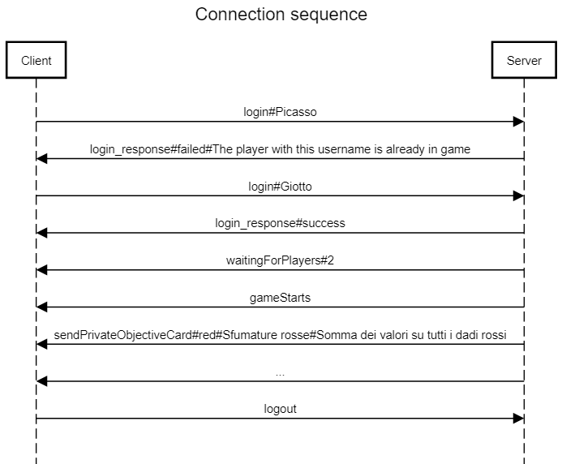

Spaces is replaced with hash (`#`).

## Connection commands

### From client to server
- `login username` Client request to login with username.
- `logout` Client request to logout (leave game).

### From server to client

- `login_response (success sessionID)|(fail code)` Server response to client login request. If successful a session id is sent to the user, otherwise one of the following codes are sent:
  - `0` There's already a logged user with the same username
  - `1` The lobby is full
- `waitingForPlayers num` Inform client that the server is waiting to start game.
- `gameStarts` Inform client that the game in started.
- `new_user username` Inform client that a new user has logged in the room.
- `suspended_user username` Inform client that another user has been suspended.
- `players_list username [username] [username] [username]` Send the complete players list.
- `not_logged [Msg]` Inform client that he has to login before logout.

# Game

## Preparation

### From server to client

- `sendPrivateObjectiveCard color name description` Send private objective card to user.
- `sendWindowPatterns WindowPattern WindowPattern WindowPattern WindowPattern` Send window patterns to player.
  - `WindowPattern := name difficulty Cell[0][0] Cell[0][1] ... Cell[4][4] cell[4][5]`
  - `Cell := restriction Dice`
  - `Dice := value color`
- `showPublicObjectiveCard PublicObjectiveCard PublicObjectiveCard PublicObjectiveCard` Send public objective cards to player.
&nbsp;&nbsp;&nbsp;&nbsp;`PublicObjectiveCard := id name description points`
- `showToolsCard ToolCard ToolCard ToolCard` Send public objective cards to player.
&nbsp;&nbsp;&nbsp;&nbsp;`ToolCard := id name description`
- `sendPlayersInfos PlayerInfo` Send players infos.
&nbsp;&nbsp;&nbsp;&nbsp;`PlayerInfo := name color`

### From client to server
- `selectWindowPattern index` Send the index of the window pattern selected (after `sendWindowPattern`).

## Players and round command

### From server to client

- `sendPlayers Player [Player] [Player]` Send other players' public informations.
  - `Player := state WindowPattern favorTokens`
- `roundOrder roundNumber index index [index] [index]` Send players order in current round.
- `currPlayer index` Send current player.
- `updateRoundTrack DiceList ... [DiceList]` Update the round track.
  - `DiceList := (Dice ... [Dice])`

### From client to server

- `selectWindowPattern index` Select one of the window pattern previously received with `showWindowPatterns`.

## Dice commands

#### From client to server

- `rollDicesFromBag` Extract dices from bag, roll them and places them in draft.
- `placeDice row col Dice` Place dice in player's window pattern.

#### From server to client

- `sendDraft Dice ... [Dice]` Send dices in draft.
- `placeDice_response success|failed [errMsg]`

## Cards commands

### From client to server

- `useToolCard id`

### From server to client

- `useToolCard_response success|failde [errMsg]`
- `setToolCardTokens id num` Set favor tokens of a tool card.

## End game commands

- `sendScores score score [score] [score]` Send all players' score.
- `sendWinner index`

### Protocol Messages Structure Examples :
- `login#Picasso` LOgin from a user called Picasso
- `login_response#failed#The game lobby is already full!` Login failed because the game is starting or is already started
- `roundOrder#4#0#1#2#3#3#2#1#0` In the 4th round, the order of players that will play is Players[0] -> Player[1] -> Player[2] -> Player[3] -> Player[3] > Player[2] -> Player[1] -> Player[0]

### Sequence diagram connection example

